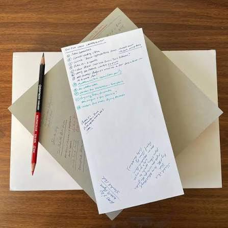
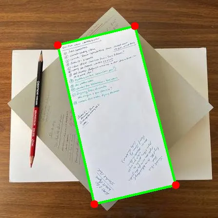
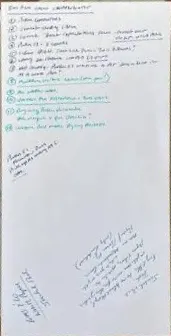

# SmartDocAligner

This repository contains tools for evaluating and testing the [DocAligner](https://github.com/DocsaidLab/DocAligner) document corner detection model on the SmartDoc dataset.

## Setup

Ensure you have Python installed, then create a virtual environment and install the dependencies:

```bash
python -m venv .venv
# On Windows:
.venv\Scripts\activate
# On Mac/Linux:
source .venv/bin/activate

pip install -r requirements.txt
```

## Running the Evaluation Script

To run the evaluation script against the test dataset:

```bash
python evaluate_docaligner.py
```
This extracts frames, infers the corners using the `fastvit_sa24` backbone, computes metrics (pixel error and IoU), and generates visual comparisons.

## Running the Gradio Web App

We provide an interactive web app to test DocAligner with your own images (e.g. photos from your phone). To start the app locally:

```bash
python app.py
```

Then, open your web browser to `http://127.0.0.1:7860`. You can upload any paper document photo to see the detected corners and the auto-cropped result in real-time.

## Evaluation Results

Below are some examples of the model's performance on the dataset. The green box represents the ground truth, and the red box represents the model's prediction:




